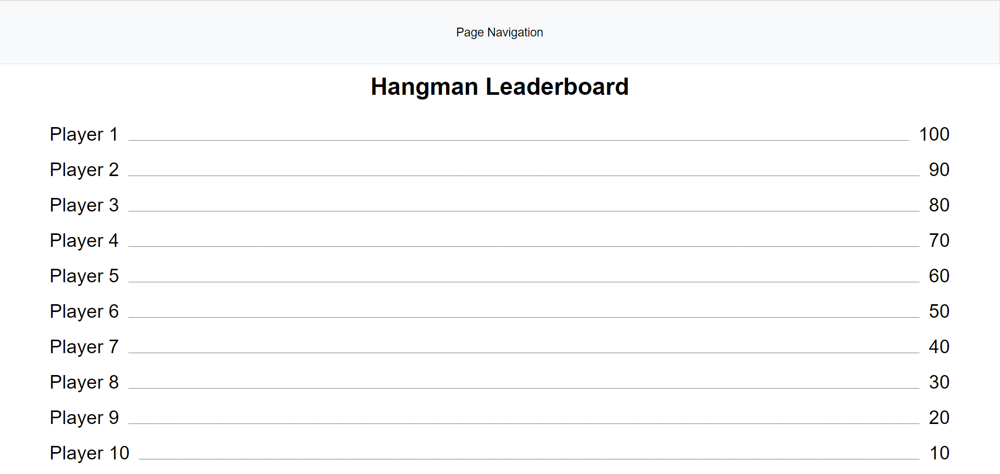
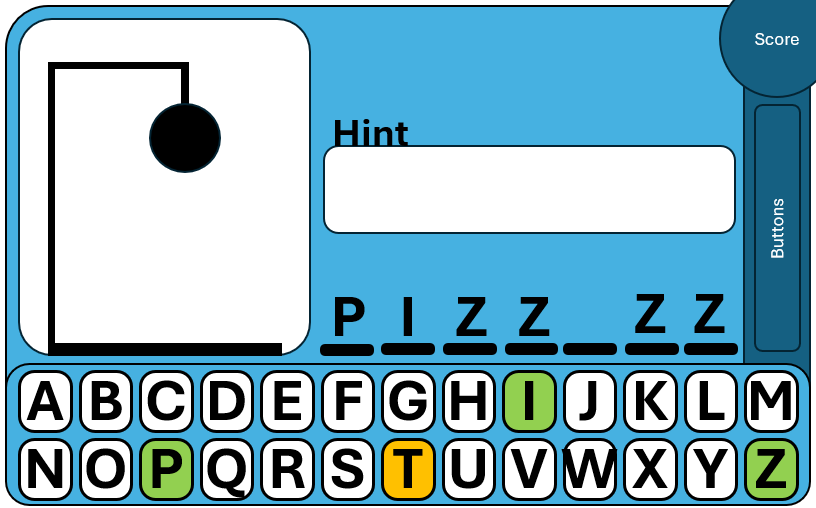
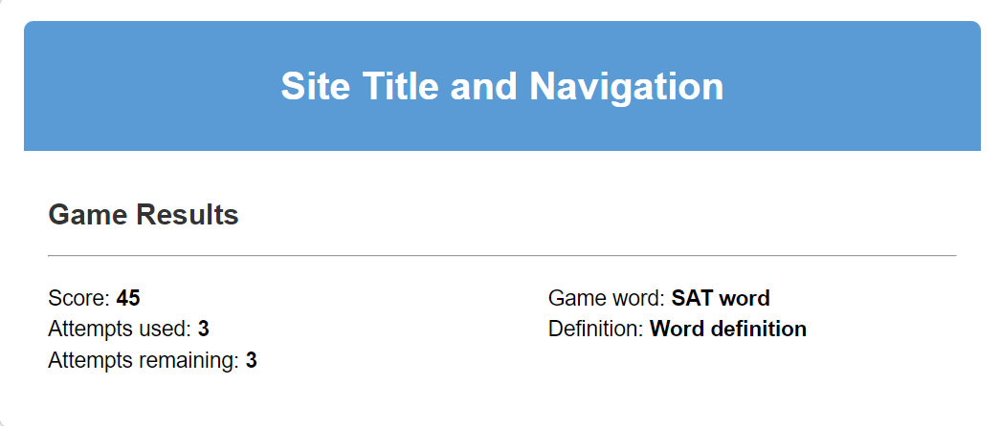
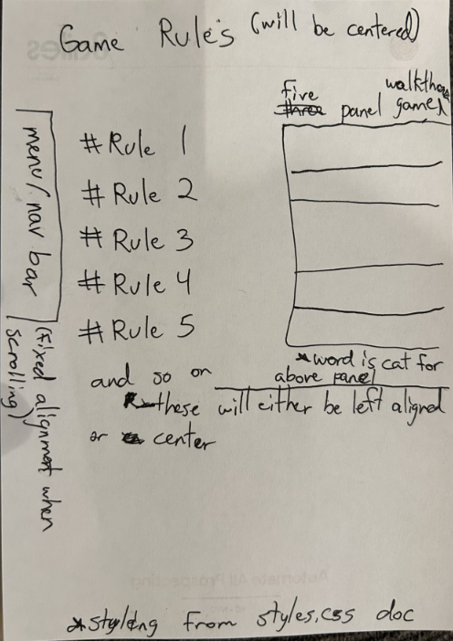
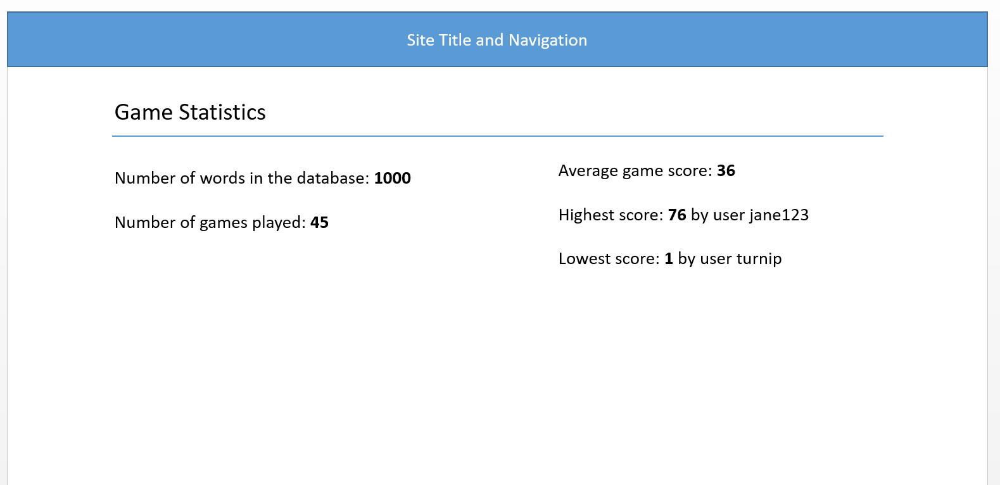

# Web Pages Design

## Home/Leaderboard

### Page Title

Homepage/Leaderboard

### Page Description

Page to display the leaderboard with the top 10 scores, and the names of the players who got the score.

### Data needed to render the page

Data to pull from the database:
- Top 10 Scores, and corresponding player names, sorted by score, as a list of dictionaries

### Link destinations for the page

Navigation bar will appear on all pages including this one and will contain links to other pages

- Home/Leaderboard: /
- Play Game: /play
- Game Rules: /rules
- Statistics: /statistics

### List of tests for verifying the rendering of the page
Scores and Player Names:

- Query the top 10 scores, and cooresponding player names and validate that they match what is on the page

## Play Game

### Page Title

Game

### Page Description

User interface that displays the number of letters as horizontal lines to be filled in by letters and an erected gallows for the hangman to populate on. A series of 26 buttons will be presented, each with a unique letter of the alphabet. When a letter is pressed, it will turn green if correct and orange if incorrect. Each wrong letter will display a new part of the hangman and each correct letter will populate the placement(s) of that letter on the game board. A hint button will be present that can be clicked once per turn. A current score will populate in the top right corner and a skip button will be available in the bottom right.

### Data needed to render the page

Data to pull from the database:
- 1 word, the user's score, and the hint to the word.

### Link destinations for the page

Navigation bar will appear on all pages including this one and will contain links to other pages

- Home/Leaderboard: /
- Play Game: /play
- Game Rules: /rules
- Statistics: /statistics

### List of tests for verifying the rendering of the page
Scores and Player Names:

- Typing a wrong letter adds a body part
- Requesting a hint populates a hint
- running out of body parts ends the game and decreases the score
- guessing the word increases the score

## Game Results

### Page Title

Game Results

### Page Description

Page the lists the game score, the attempts used and remaining, and the game word and definition.

Mockup of basic page layout with fields:

### Parameters needed for the page

None

### Data needed to render the page

Statistics will be pulled from the database:

- Current game score
- Game word
- Game word definition
- Attempts used
- Attempts remaining

### Link destinations for the page

Navigation will contain links to other pages including Statistics

- Home/Leaderboard: /
- Play Game: /play
- Game Rules: /rules
- Statistics: /statistics

### List of tests for verifying the rendering of the page

Current game score:

- Query the game score and validate that number is equal to what is displayed on page.

Game word:

- Query the current game word and validate that word is what is displayed on page.

Word definition:

- Query the word definintion and validate that definition is what is displayed on page.

Attempts used:

- Query attempts used and validate that number is equal to what is displayed on page.

Attempts used:

- Query attempts remaining and validate that number is equal to what is displayed on page.

## Game Rules

### Page Title

Games Rules

### Page Description

Page that lists all the game rules. This page shows a basic step by step of how to play the game as well, this could just be a text description of the game steps. The word used is cat.

Mockup of basic page layout with fields and alignment:

### Parameters needed for the page

None

### Data needed to render the page

None

### Link destinations for the page

Navigation will contain links to other pages including Rules

- Home/Leaderboard: /
- Play Game: /play
- Game Results: /results
- Game Rules: /rules
- Statistics: /statistics

### List of tests for verifying the rendering of the page

Does the page load correctly when selected from the navigation bar of the other pages. Do the styles display correctly.

- Try to navigate to this page from the other four pages via the navigation bar.

Do the navigation bar links execute correctly when selected.

- Try to navigate to each of the other four pages from this page's navigation bar.

## Statistics Page

### Page Title

Game Statistics

### Page Description

Page to show various game and word statistics. This page will inform users about the activity of the website and how their scores compare to others.

Mockup of basic page layout with fields:

### Parameters needed for the page

None

### Data needed to render the page

Statistics will be pulled from the database:

- Number of games played
- Number of words in the database
- High score and user
- Low score and user
- Average score

### Link destinations for the page

Navigation will contain links to other pages including Statistics

- Home/Leaderboard: /
- Play Game: /play
- Game Rules: /rules
- Statistics: /statistics

### List of tests for verifying the rendering of the page

Number of games played:

- Query the number of games in the games table and validate that number is equal to what is displayed on page.

Number of words in the database:

- Query the number of words in the words table and validate that number is equal to what is displayed on page.

High score and user:

- Query the largest score in games table, return score and user fields. Validate score and user is equal to what is displayed on page.

Low score and user:

- Query the smallest score in games table, return score and user fields. Validate score and user is equal to what is displayed on page.

Average score:

- Use SQL AVG function to query the average score in the games table. Validate average score is equal to what is displayed on page.
