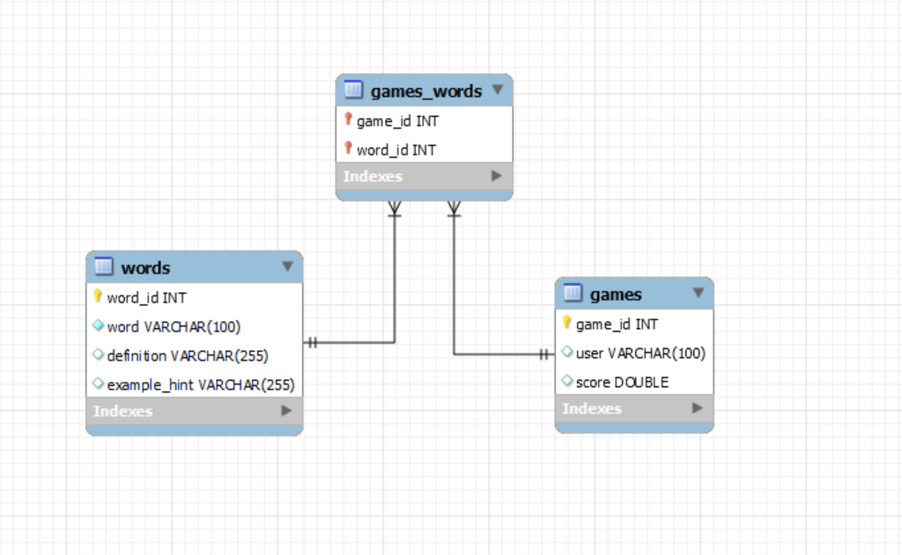

# SQL Design

## ER Diagram

## Games Table

### Table Name
games

### Table Description
Table to hold game information. Contains user and score.

### Table Fields

* game_id : This is the unique integer id generated for every game. 
* user : This is the user's name that they enter in an input field on the front-end before starting a game. This is a varchar data type with max length of 100.
* score: The user's score for the game. Score will be stored as a double data type.

### Tests for Verifying the Games Table:

* Validate games table exists
* Validate each column exists 

### Data Access Methods

1. **Name: Leaderboard**

    Description: Generate list of top game scores

    Parameters: None

    Return values: List of dictionaries containing user and score values

    **Test: Get games with top scores the for home page in the leaderboard section**

    Use case name: Validate top scores are shown on the home page

    Description: Test home page leaderboard

    Pre-conditions: There is at least one game in the games table

    Test steps:
    * Navigate to the home page

    Expected result: User should view the games with the top scores

2. **Name: Add Game**

    Description: Add a new game to the games table

    Parameters: user, score

    Return values: game_id

    **Test: Insert new game to games table**

    Use case name: Validate that the new game is added to the games table

    Description: Test that a new game is successfully added to the games table, in the correct order.

    Pre-conditions: User has completed a game

    Test steps:
    * Navigate to the play games page
    * Complete a game
    * Continue to results page

    Expected result: On results page there should be information about the user's completed game.

## Words Table

### Table Name
words

### Table Description
Table to hold words and their definitions for the game of hangman. Contains the word, its definition, and an example hint.

### Table Fields

* word_id : This is the unique integer id generated for each word. 
* word : This is the word to be guessed in the game. This is a varchar data type with a max length of 100.
* definition: This is the definition of the word. This is a varchar data type with a max length of 255.
* example_hint: This is an example hint to help the player guess the word. This is a varchar data type with a max length of 255.

### Tests for Verifying the Words Table:

* Validate words table exists
* Validate each column exists

### Data Access Methods

1. **Name: Get Random Word**

    Description: Retrieve a random word for a game

    Parameters: None

    Return values: Dictionary containing word, definition, and example_hint values

    **Test: Retrieve a random word for the game**

    Use case name:  Validate a random word is retrieved successfully

    Description: Test the random word retrieval functionality for the game

    Pre-conditions: The words table has at least one entry

    Test steps:
    * Trigger the word retrieval function by starting a new game

    Expected result: A word along with its definition and example hint is returned
2. **Name: Retrieve Word by ID**

    Description: Retrieve a specific word by its word_id

    Parameters: word_id

    Return values: Dictionary containing word_id, word, definition, and example_hint

    **Test: Retrieve Word by ID**

    Use case name: Validate retrieval of a specific word by its ID

    Description: Ensure a specific word can be retrieved using its word_id

    Pre-conditions: The words table has entries

    Test steps:
    * Trigger the function to retrieve the word by its word_id
    * Verify that the retrieved word matches the desired word in the table

    Expected result: The function returns the correct word, definition, and example hint for the given word_id.

## Games_Words Table

### Table Name
games_words

### Table Description
Table to track the words used in specific games. This table creates a many-to-many relationship between games and words.

### Table Fields

* game_id: This is the unique integer id of the game in which the word was used.
* word_id: This is the unique integer id of the word that was used in the game.

### Tests for Verifying the Game_Words Table:

* Validate the games_words table exists
* Validate each column exists

### Data Access Methods

1. **Name: Mark Word As Used**

    Description: Mark a word as used for a specific game

    Parameters: game_id, word_id

    Return values: None

    **Test: Insert used word into games_words table**

    Use case name:  Validate that a word is marked as used in a specific game

    Description: Test that a word is successfully marked as used in the games_words table

    Pre-conditions: The games and words tables have entries

    Test steps:
    * Trigger the word usage function with a specific game_id and word_id

    Expected result: The word is marked as used in the games_words table
2. **Name: Check If Word Is Used**

    Description: Check if a word has already been used in a specific game
   
    Parameters: game_id, word_id

    Return values: Boolean indicating whether the word has been used

    **Test: Verify word usage in a game**

    Use case name: Validate that the function correctly checks word usage

    Description: Test the functionality to verify if a word has been used in a specific game

    Pre-conditions: The games_words table has entries

    Test steps:
    * Trigger the check function with a specific game_id and word_id
      
    Expected result: The function correctly returns whether the word has been used in the specified game

3. **Name: Retrieve Words for a Game**

    Description: Retrieve all words used in a specific game

    Parameters: game_id

    Return values: List of dictionaries containing word_id, word, definition, and example_hint

    **Test: Retrieve words used in a specific game**

    Use case name: Validate retrieval of all words used in a specific game

    Description: Test the functionality to retrieve all words associated with a specific game_id

    Pre-conditions: The games_words table has entries linking games to words

    Test steps:
    * Trigger the retrieval function with a specific game_id

    Expected result: A list of words, including their word_id, word, definition, and example_hint, is returned for the specified game
