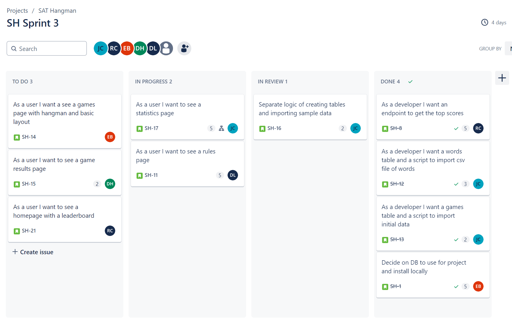
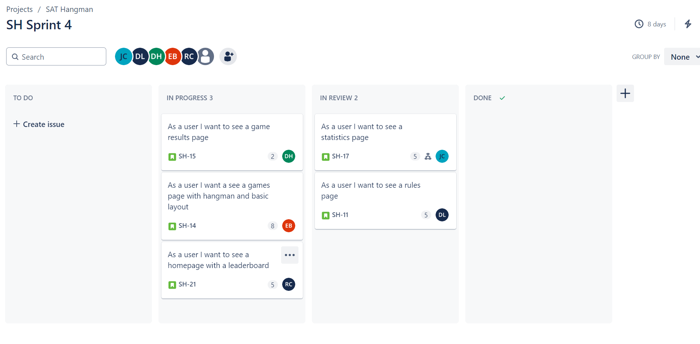
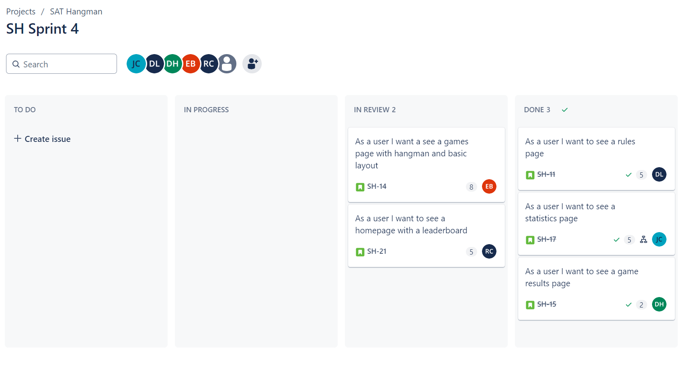

# Weekly Status Meeting - 6/25/24

- Julia
-   Last week - Worked on SH-4
-   Wrote up a doc for team to help install local Flask via pull request, will help team members if needed
-   this week - SH-9 is next
-   blockers: none

- Darby
-   Last week - Worked on creating sudo code for game logic, up for review
-   This week - start SH-6 - creating game leaderboard on hompage
-   blockers: none

- Dana
-   Last week - started Discovery for styling, wrote down ideas for sections of game
-   This week - wrap up discovery and start next card - possibly theme card
-   blockers: potentially any issues with initial setup

- Robert
-   Last week - SH-2 lined out SAT words, via Python script
-   This week - endpoint for top scores SH-8
-   blockers: none, pending Evan's code

- Evan
-   sick during meeting
-   Status - "Was able to set up the database locally and mock up a few endpoints using flask. I'll be making a pull request for you all to review early tomorrow afternoon/evening"
-   blockers: none

# Weekly Status Meeting - 7/2/24

Julia
- Last week - Helped team get local flask development setup and completed SH-9, POC of using pytest for front-end testing.
- This week - SH-10 creating a navigation component.
- Blockers: none

Darby
- Last week - Started the home page HTML which includes the game leaderboard.
-  This week - Continue SH-6 and use HTML template in home page route.
-  Blockers: none

Dana
- Last week - Wrapped up discovery on hangman visualization and got VS Code development environment setup.
- This week - SH-11 create rules page template and create route in app.py.
- Blockers - none

Robert
- Last week - Started creation of endpoint for the leaderboard page to pull in data from the db.
- This week - Continue SH-8 and integrate.
- Blockers - none

Evan
- Last week - Installed DB locally, configured, and documented instructions for team.
- This week - Make pull request for that work and start SH-7 to create CSS classes for app theme.
- Blockers - none

# Weekly status meeting July 09 2024

Dana

- Last week: reviewed pull requests
- This Week:This weeks lab midterm this weekend put focus back toward project
- Blockers:None

Evan

- Last Week: Put in pull request for database info going into main readme 
Making small mod to that because julia noticed the pull request had unintentional folders. Drafted up css for the project as well as tough draft for how the hangman will work
- This Week: Will be making the game page and text entry etc. 
- Blockers: None expected. Has done a lot in react but using raw HTML he may need to get more used to but once he figures it out he’ll be steaming away.

Julia

- Last week: Did SH-10 navigation component
- This week: there’s a pull request out for the team. This week will work on sh12 will be creating a words table in the database and script to import the csv
- Blockers: none

Robert

- Last week: worked on creating an endpoint for the leaderboard in flask
- This week: Will work on creating the page for the leaderboard, and testing the flask endpoint, and merging the project
Blockers: none

Darby

- Last week: worked on integrating homepage and endpoint into current app setup. 
- This week: finish integration 
- Blockers: none

# Weekly Status Meeting July 18 2024

Dana

- Last week: Worked on SH-11 to create a rules page
- This Week: Finish SH-11 and MySQL installation
- Blockers:None

Evan

Julia

- Last week: Worked on SH-12 to populate words table and testing
- This week: Work on SH-13 creating games table and games words table with mock data
- Blockers: none

Robert

- Last week: Continued working on SH-8 HTML page and route in flask
- This week: Work on getting words table set up
- Blockers: Waiting on tables for SH-8

Darby

- Last week: Finished integrating homepage with app setup
- This week: Get MySQL installed and work on getting words table set up
- Blockers: Having issues getting MySQL installed properly

# Weekly Status Meeting - 7/23/24

Julia
- Last week - Completed SH-13 and SH-16, creating scripts to create database tables, import mock data, and tests
- This week - SH-17 create the Statistics page
- Blockers - none

Darby
- Last week - got mysql installed
- This week -  finish words table and work on game results page
- Blockers -  none

Dana
- Last week - drafted the rules page, worked with Julia on the SQL Design assignment - games table page, got mysql installed
- This week - work on the rules page, get the db table creation and adding data scripts to run successfully
- Blockers - none

Robert
- Last week -
- This week - 
- Blockers -

Evan
- Last week - 
- This week -
- Blockers - 

# Weekly Status Meeting - 7/30/24

Julia
- Last week - Completed SH-17 and is in review
- This week - Make a couple changes in SH-17 from team feedback, prepare for team presentation
- Blockers - None

Darby
- Last week - Worked on SH-15
- This week - Finish SH-15 and put in for review, prepare for presentation
- Blockers -  None

Dana
- Last week - Worked on SH-11, specifically looked at adding the nav into the page, draft of page completed, route added, test page completed
- This week - troubleshoot getting the rules page connected, confirm that my test works
- Blockers - None

Robert
- Last week -
- This week - 
- Blockers -

Evan
- Last week - 
- This week -
- Blockers - 

# Weekly Status Meeting - 8/6/24

Julia
- Last week - Reviewed PRs and made adjustments to navigation and statistics page from team feedback.
- This week - Final testing of application, prepare for presentation, and assist in final deliverables for project.
- Blockers - None

Darby
- Last week - 
- This week - 
- Blockers - 

Dana
- Last week - Got the rules page route working successfully, got a draft of the rules page added, and a first pass at the css page
- This week - Created a rules.css file, updated the Rules.html file accordingly, double checked that everything still runs correctly, also ran Flask and tested out the application pages, mainly the home page and rules page. Met with group, decided on presentation order and presentation logistics. Prep my portion of the presentation. Assist with the final deliverables for the project.
- Blockers - None

Robert
- Last week - Worked on integrating the navbar into the leaderboard page
- This week - Create tests and finalize leaderboard page, work on preparing for presentation
- Blockers - None

Evan
- Last week - 
- This week -
- Blockers - 
